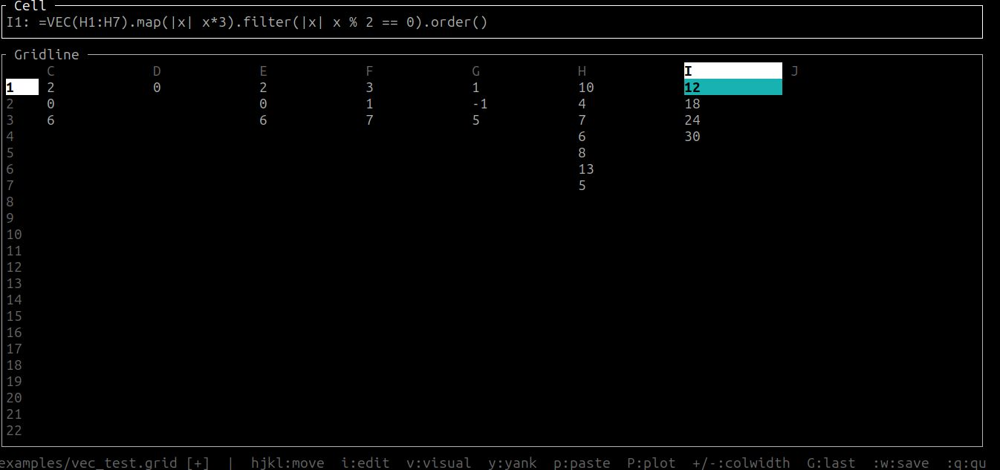
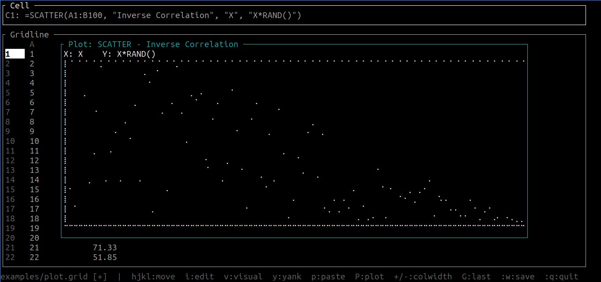
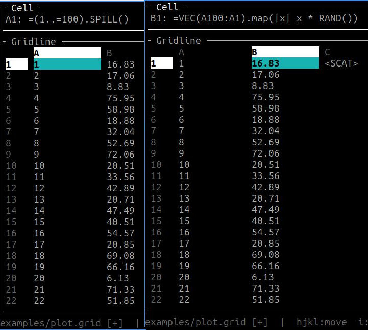

<p align="center">
  <a href="https://www.rust-lang.org/"></a>
  <a href="https://rhai.rs/book/index.html"></a>
  <a href="https://github.com/ratatui/ratatui"></a>
</p>

# Gridline ✨

Gridline is a proof-of-concept terminal spreadsheet with Rhai support. Cells can contain numbers, text, or formulas powered by the [Rhai scripting language](https://rhai.rs/book/index.html). Your sheet lives in a plain text file, and your reusable logic can live in a separate `.rhai` functions file.

What you get (today):
- TUI grid with a formula bar and command mode
- A1-style references in formulas (`=A1 + B2`) and range functions (`=SUM(A1:B5)`)
- Dependency tracking and recalculation with undo/redo support
- Load/reload user functions from a `.rhai` file (`-f` at startup, `:source` at runtime)
- Vim keybindings by default, optional Emacs keymap
- Custom keymaps via TOML (optional override)
- Plain text storage format (one cell per line)
- CSV import/export (`:import`, `:export`)
- Markdown export with ASCII charts (`-o` flag or command mode)
- Command-line evaluation mode (`-c` flag)
- Row/column insertion and deletion
- Simple plotting in a modal (bar/line/scatter)
- Interactive help system (`:help`)

Project status: this is a POC. Expect rough edges (especially around plotting and any non-trivial spreadsheet ergonomics).

Why it's fun:
- 🧾 Plain-text sheets you can diff and version
- 🧠 Formulas are real Rhai scripts (with spreadsheet sugar)
- 📈 Quick plots right in the terminal

## Screenshots

<p align="center">
  <a href="screen.jpg">
    
  </a>
  <br />
  <sub>Fast, keyboard-first spreadsheets in your terminal: formulas, ranges, and a real formula bar.</sub>
</p>

<p align="center">
  <a href="plot.jpg">
    
  </a>
  <br />
  <sub>Turn data into insight without context-switching: quick plots right where you work.</sub>
</p>

<p align="center">
  <a href="spill.jpg">
    
  </a>
  <br />
  <sub>Go beyond cell-by-cell: SPILL + Rhai lets you generate and reshape tables with reusable logic.</sub>
</p>

## Quick Start 🚀

Build and run:

```bash
cargo run
```

Open an example file:

```bash
cargo run -- examples/plot.grid
```

### Command-line Evaluation

Evaluate formulas without opening the TUI:

```bash
# Evaluate and print to stdout
cargo run -- -c "SUM(0..100)"

# Evaluate and export to markdown
cargo run -- -c "VEC(1..20).map(|x| POW(x, 2))" -o squares.md

# Export existing file to markdown
cargo run -- examples/plot.grid -o plot.md
```

### Loading Functions

Load custom Rhai functions at startup (can specify multiple files):

```bash
cargo run -- -f examples/functions.rhai examples/plot.grid
cargo run -- -f lib1.rhai -f lib2.rhai examples/plot.grid
```

Auto-load a default functions file if present:
- config directory `gridline/default.rhai` (platform-specific)
  - Linux: `~/.config/gridline/default.rhai`
  - macOS: `~/Library/Application Support/me.shoryuken.gridline/default.rhai`
  - Windows: `%APPDATA%\\shoryuken\\gridline\\config\\default.rhai`

Load or reload functions at runtime:

```text
:source examples/functions.rhai
:so                                 # reload all loaded files
```

## Cell Input Rules 🧾

Gridline interprets cell input like this:
- empty / whitespace => empty cell
- leading `=` => formula (Rhai script; stored without the `=`)
- quoted `"text"` => text (quotes stripped)
- otherwise, parseable as `f64` => number
- else => text

Examples:
```text
A1: 10
A2: "hello"
A3: =A1 * 2
A4: =SUM(A1:A3)
```

## Formulas (Rhai + Spreadsheet Sugar) 🧠

Inside formulas:
- `A1` becomes `cell(0, 0)` (0-indexed internally)
- `@A1` becomes `value(0, 0)` (typed access: numbers/text/bools)
- `SUM(A1:B5)` becomes `sum_range(0, 0, 4, 1)`

Arrays "spill" down the column.
If you need to do an in-place operation that returns `()` (like Rhai's `Array.sort()`), use `OUTPUT`:

```text
A1: 30
A2: 10
A3: 20
B1: =OUTPUT(VEC(A1:A3), |v| { v.sort(); v })
```

Typed refs are useful when a referenced cell contains text (or a formula that returns text):

```text
B1: =if C1 > 100 { "expensive" } else { "cheap" }
A1: =len(@B1)
```

Built-in range functions (ALL CAPS):
- `SUM`, `AVG`, `COUNT`, `MIN`, `MAX`
- `SUMIF(range, |x| condition)` - sum values where predicate is true
- `COUNTIF(range, |x| condition)` - count cells where predicate is true
- `VEC` (convert a range to an array; respects direction: `VEC(A3:A1)` returns `[A3, A2, A1]`)
- `SPILL(arr)` or `SPILL(range)` - convert ranges/arrays to spillable arrays (also available as method: `arr.SPILL()`)
- Chart functions: `BARCHART`, `LINECHART`, `SCATTER` (support optional title and axis labels)

Other built-ins:
- `ROW()` - current cell's row (1-indexed)
- `COL()` - current cell's column (1-indexed)
- `RAND()` - random float in `[0.0, 1.0)`
- `RANDINT(min, max)` - random integer in `[min, max]` inclusive
- `POW(base, exp)` - exponentiation (base^exp)
- `SQRT(x)` - square root
- `OUTPUT(value, fn)` - apply function to value and return result (useful for in-place operations like `sort()`)

### Custom Functions Example 🧩

Create a `.rhai` file:

```rhai
fn fib(n) {
  if n < 2 { n } else { fib(n - 1) + fib(n - 2) }
}
```

Load it (either `-f` or `:source`), then use it in a cell:

```text
A1: "Fibonacci"
B1: 10
C1: =fib(B1)
```

## Plotting 📈

Plotting works by making a formula cell return a tagged plot spec. The grid shows a placeholder (e.g. `<BAR>`), and you can open the plot modal.

Example (`examples/plot.grid`):

```text
C1: =SCATTER(A1:B5, "title", "xaxis", "yaxis")
D1: =BARCHART(B1:B5)
```

Open the plot modal:
- Vim keymap: `P`
- Emacs keymap: `M-p`

## Commands ⌨️

Command mode:
- Vim: `:`
- Emacs: `M-x`

### File Operations
- `:w` or `:w <path>` (alias `:save`) - save
- `:q` - quit (warns if modified)
- `:q!` - force quit
- `:wq` - save and quit
- `:e <path>` (alias `:open`) - open file
- `:import <file.csv>` - import CSV data at current cursor position
- `:export <file.csv>` - export grid to CSV format

### Navigation
- `:goto A100` (alias `:g A100`) - jump to a cell

### Grid Editing
- `:ir` or `:insertrow` - insert row above current row
- `:dr` or `:deleterow` - delete current row
- `:ic` or `:insertcol` - insert column to the left of current column
- `:dc` or `:deletecol` - delete current column
- `:colwidth 15` (alias `:cw`) - set current column width
- `:colwidth A 15` - set a specific column width

### Functions and Help
- `:source <file.rhai>` (alias `:so`) - load functions; `:so` with no args reloads all loaded files
- `:help` or `:h` - open help modal

## Keymaps 🗺️

Select keybindings:

```bash
gridline --keymap vim
gridline --keymap emacs
gridline --keymap vim --keymap-file /path/to/keymaps.toml
```

Keymap files (optional):
- Default location: config directory `gridline/keymaps.toml` (platform-specific)
- Override with `--keymap-file <path>`
- If a keymap name is not found in the file, Gridline falls back to the built-in map (`vim` or `emacs`)
  - Linux: `~/.config/gridline/keymaps.toml`
  - macOS: `~/Library/Application Support/gridline/keymaps.toml`
  - Windows: `%APPDATA%\\gridline\\keymaps.toml`

Sample keymap file:
- `docs/keymaps.toml`

Status bar has an always-on cheat sheet, but the core controls are:

### Vim Mode (default)
- `hjkl` - move cursor
- `i` or `Enter` - edit cell
- `Esc` - cancel edit
- `v` - visual select (start range selection)
- `y` - yank (copy)
- `p` - paste
- `u` - undo
- `Ctrl+r` - redo
- `>` or `+` - increase column width
- `<` or `-` - decrease column width
- `P` - open plot modal
- `:w` - save
- `:q` - quit
- `:help` - open help modal

### Emacs Mode (experimental)

**Note:** Emacs mode is incomplete and must be enabled with `--keymap emacs`. Some documented keybindings may not work as expected.

- `C-n/p/f/b` - move cursor (next/previous/forward/back)
- `Enter` - edit cell
- `C-g` - cancel edit
- `C-SPC` - set mark (start visual selection)
- `M-w` - copy
- `C-y` - paste
- `M-p` - open plot modal
- `M-x` - command mode

Use `:w` and `:q` in command mode for save/quit operations.

## File Formats 📁

### Grid Files (.grid)

Plain text format with one cell per line:

```text
CELLREF: VALUE
```

Comments start with `#`. Values follow the same input rules as interactive editing.

### CSV Import/Export

Import CSV data into your grid:

```bash
# In command mode
:import data.csv
```

Export grid to CSV:

```bash
# In command mode
:export output.csv
```

CSV features:
- Preserves leading zeros in numeric strings
- Handles quoted fields and escaped quotes
- Imports at current cursor position

### Markdown Export

Export your grid as a markdown table with ASCII charts:

```bash
# Command-line export
cargo run -- examples/plot.grid -o output.md

# Or evaluate formula and export
cargo run -- -c "VEC(1..10).map(|x| x * x)" -o squares.md
```

The markdown export includes:
- Grid data as a markdown table
- ASCII renderings of any charts
- Row and column labels

## Development 🔧

```bash
cargo fmt
cargo clippy --all-targets -- -D warnings
cargo test
```

## License 📜

Licensed under either of:
- Apache License, Version 2.0 (`LICENSE-APACHE`)
- MIT license (`LICENSE-MIT`)
